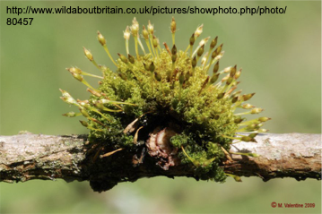

# BIOL 210 Problem Set 3

## General Instructions for Problem Sets

The goal of the problem sets is to give you practice thinking about and
working with the concepts that we are covering. You may work with others
to complete these assignments but should submit your own responses (not
copied from someone else’s response).

**Before completing a problem set, you should review the content videos
for the week and it may be helpful to complete those before the related
class periods as well.**

Once you have answered the questions and before you turn in your
responses, check your work against the answer key (linked for each
problem set). If your responses are missing important information or
incorrect, you need to correct them, using a different color font and
explaining why your original answer was insufficient.

Use the link at the top of this page to turn in your completed
assignment, including corrections.

## Related Readings

#### About Information Transmission (Mitosis and Meiosis)

- Background reading from the open textbook [Biology
  2e](https://openstax.org/books/biology-2e/pages/1-introduction) at
  Openstax – you can read online or download a PDF.

  - The Cell –\> Chapter 10. Cell Reproduction
  - Genetics –\> Chapter 11. Meiosis and Sexual Reproduction  
      

- Schmerler, S and GM Wessel. 2011. [Polar bodies—more a lack of
  understanding than a lack of
  respect.](https://www.ncbi.nlm.nih.gov/pmc/articles/PMC3164815/)
  78:3-8.

  *This is another awesome review paper describing the diverse ways in
  which organisms produce and use polar bodies in meiosis. While they
  degenerate in humans (we are SO boring!), they can be a super
  important part of the development of others – from flowering plants to
  parasitic wasps.*

- Wilkins, AS, and R Holliday. 2009. [The evolution of meiosis from
  mitosis.](https://www.ncbi.nlm.nih.gov/pmc/articles/PMC2621177/)
  Genetics 181:3-12.

  *In this article, the authors present a hypothesis for the evolution
  of meiosis from mitosis, review the available evidence bearing on the
  hypothesis, and propose possible tests of the hypothesis.*

#### About Life Cycles

- Background reading from the open textbook [Biology
  2e](https://openstax.org/books/biology-2e/pages/1-introduction) at
  Openstax – you can read online or download a PDF.

  - Biological Diversity –\> Life cycle information is available in
    taxon-specific chapters.  
      

- From Gathering Moss, [The Advantages of Being
  Small](https://drive.google.com/file/d/1KkPjSXMsXQb4zk1l5PHosNmVspRlqcaB/view?usp=sharing)
  and [Back to the
  Pond](https://drive.google.com/file/d/1E7JyiTvrmGsqjXagaWIFG3PHX6ed-aBO/view?usp=sharing)

- Mable, BK, and SP Otto. 1998. [The evolution of life cycles with
  haploid and diploid
  phases.](https://www.zoology.ubc.ca/~otto/Reprints/Mable1998.pdf)
  BioEssays 20:453-462.

  *This review paper describes what we know about the evolution of
  variation in the life cycle. I.e., why are some organisms haploid
  dominant, others diploid dominant and still others have prominent
  haploid phases AND prominent diploid phases?*

## Questions

1.  Consider the processes of cell reproduction.

    1.  How is cell division similar and different in prokaryotic and
        eukaryotice cells?
    2.  What do you predict might happen if the spindle fibers did not
        form during mitosis in a eukaryotic cell?
    3.  What do you predict might happen in a prokaryotic cell if a
        protein important in constricting the plasma membrane and cell
        wall during cytokinesis was non-functional?

      

2.  In the fruit fly *Drosophila melanogaster*, a new zygote is created
    when sperm fertilize eggs inside the female parent’s oviduct. The
    sperm and eggs are haploid, the products of meiosis, while the new
    zygote is diploid. The female parent then lays the fertilized egg
    (zygote) on a suitable food source. Eggs are white, ovoid, and about
    0.5 mm long. About 21 hours after they are laid, eggs hatch and the
    larvae emerge. The larvae develop in stages known as instars, which
    are common to many insect species. The newly emerged larvae, known
    as the first instar, are voracious eaters. They are tiny and
    difficult to see with the naked eye. The larvae grow rapidly, and
    within about two days, the first instar will molt into the second
    instar. These larvae will eat, grow, and molt again to become the
    third instar. After the third instar crawls out of the food and onto
    the surface, the larvae begin to pupate. In the pupal stage, the
    larval body shortens and the cuticle hardens and becomes pigmented,
    developing into the pupal case. Metamorphosis occurs within the
    pupal case; dormant localized tissues that originated during the
    embryonic stages develop into their adult forms, while the remaining
    larval tissue is broken down to furnish both raw material and the
    energy needed for adult development. After three days, the adult
    emerges. The adult flies reach sexual maturity and begin producing
    new gametes about eight hours after emerging from the pupae, and
    then the cycle can begin again.

    **For each of the following, indicate whether the situation
    describes cells that are haploid or diploid and whether mitosis or
    meiosis is occurring:**

    - sperm produced in the male fly
    - unfertilized eggs produced in the female fly
    - a new zygote before the egg has hatched
    - 1st instar larvae growing rapidly
    - 3rd instar larvae growing rapidly
    - a pupa develops into an adult
    - the body cells of an adult fly

      

3.  On meiosis.
    1.  What are three ways in which meiosis differs from mitosis?
    2.  What two processes during meiosis result in genetically unique
        daughter cells? Explain how they create genetically variable
        daughter cells.

      

4.  Among the related readings are a couple of chapters from Gathering
    Moss (The Advantages of Being Small and Back to the Pond). In Back
    to the Pond, Kimmerer talks about the moss life cycle, which is
    different from that of vascular plants. Check out the graphic of a
    moss life cycle from Biology 2e
    ([link](https://openstax.org/books/biology-2e/pages/25-3-bryophytes)).
    Note that mosses belong to a group called the bryophytes. Then
    examine the image below.

    What can you tell me about the parts of the moss life cycle that are
    visible to you in this image? How do moss life cycles differ from
    those of vascular plants such as angiosperms and gymnosperms?

      

5.  Weekly Reflection. Consider this week’s material and reply to one or
    more of the following prompts:
    - What was confusing or interesting to you about this week’s
      material?
    - Did you have any key insights while studying this material?
    - Does anything from this week’s material particularly stick with
      you?

  

**When you are finished, check your responses on the [key for
PS3](https://aroles.github.io/biol210/articles/ps3key.md).**

Remember to sign the Honor Code on your assignment.
